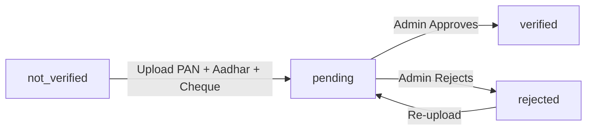

# 📄 KYC Document Storage Setup Guide

## 🎯 Overview

KYC documents aur profile images **Cloudinary** pe store hote hain (cloud-based image/document storage service).

---

## 📁 Storage Structure

### **Cloudinary Folders:**
```
nlistplanet/
├── profile-images/
│   └── {userId}/
│       └── profile_1234567890.jpg
│
└── kyc-documents/
    └── {userId}/
        ├── pan_1234567890.jpg
        ├── aadhar_1234567890.jpg
        ├── cancelledCheque_1234567890.pdf
        └── cml_1234567890.pdf
```

### **MongoDB Storage:**
User document me sirf **URLs** store hote hain:
```javascript
{
  profileImage: "https://res.cloudinary.com/nlistplanet/image/upload/v1234567890/profile-images/userId/profile.jpg",
  kycDocuments: {
    pan: "https://res.cloudinary.com/.../pan.jpg",
    aadhar: "https://res.cloudinary.com/.../aadhar.jpg",
    cancelledCheque: "https://res.cloudinary.com/.../cheque.pdf",
    cml: "https://res.cloudinary.com/.../cml.pdf"
  },
  kycStatus: "pending" // not_verified, pending, verified, rejected
}
```

---

## ⚙️ Cloudinary Setup (Free Tier)

### **Step 1: Create Cloudinary Account**
1. Visit: https://cloudinary.com/
2. Sign up (free tier: 25GB storage + 25GB bandwidth/month)
3. Email verify karo

### **Step 2: Get API Credentials**
1. Login → Dashboard
2. Copy these values:
   ```
   Cloud Name: nlistplanet (or your custom name)
   API Key: 123456789012345
   API Secret: AbCdEfGhIjKlMnOpQrStUvWxYz
   ```

### **Step 3: Add to `.env` File**
Backend folder me `.env` file me add karo:
```bash
CLOUDINARY_CLOUD_NAME=nlistplanet
CLOUDINARY_API_KEY=123456789012345
CLOUDINARY_API_SECRET=AbCdEfGhIjKlMnOpQrStUvWxYz
```

---

## 🚀 Backend Routes (Already Created)

### **1. Upload Profile Image**
**Endpoint:** `POST /api/auth/upload-profile-image`

**Request:**
```javascript
// FormData
{
  profileImage: File (max 10MB, JPG/PNG only)
}
```

**Response:**
```json
{
  "success": true,
  "message": "Profile image uploaded successfully",
  "profileImage": "https://res.cloudinary.com/.../profile.jpg"
}
```

**Usage (Frontend):**
```javascript
const formData = new FormData();
formData.append('profileImage', file);

await axios.post(
  `${API_URL}/auth/upload-profile-image`,
  formData,
  {
    headers: {
      'Content-Type': 'multipart/form-data',
      'Authorization': `Bearer ${token}`
    }
  }
);
```

---

### **2. Upload KYC Document**
**Endpoint:** `POST /api/kyc/upload-document`

**Request:**
```javascript
// FormData
{
  document: File (max 10MB, JPG/PNG/PDF),
  docType: 'pan' | 'aadhar' | 'cancelledCheque' | 'cml'
}
```

**Response:**
```json
{
  "success": true,
  "message": "PAN uploaded successfully",
  "documentUrl": "https://res.cloudinary.com/.../pan.jpg",
  "kycStatus": "pending",
  "kycDocuments": {
    "pan": "https://...",
    "aadhar": null,
    "cancelledCheque": null,
    "cml": null
  }
}
```

**Usage (Frontend):**
```javascript
const formData = new FormData();
formData.append('document', file);
formData.append('docType', 'pan');

await axios.post(
  `${API_URL}/kyc/upload-document`,
  formData,
  {
    headers: {
      'Content-Type': 'multipart/form-data',
      'Authorization': `Bearer ${token}`
    }
  }
);
```

---

### **3. Get User's KYC Documents**
**Endpoint:** `GET /api/kyc/documents`

**Response:**
```json
{
  "success": true,
  "kycDocuments": {
    "pan": "https://...",
    "aadhar": "https://...",
    "cancelledCheque": "https://...",
    "cml": null
  },
  "kycStatus": "pending"
}
```

---

### **4. Delete KYC Document**
**Endpoint:** `DELETE /api/kyc/document/:docType`

**Example:** `DELETE /api/kyc/document/pan`

**Response:**
```json
{
  "success": true,
  "message": "PAN deleted successfully"
}
```

---

## 🔒 Security Features

### **1. File Validation**
- **Max Size:** 10MB per file
- **Allowed Types:** JPG, PNG, PDF only
- **Virus Scan:** Cloudinary automatically scans uploaded files

### **2. Access Control**
- **Authentication Required:** All routes protected with JWT
- **User Isolation:** Each user ka apna folder (userId-based)
- **Private URLs:** Documents direct access se protected

### **3. Auto Compression**
- Profile images: 400x400, optimized quality
- Documents: Auto quality optimization
- Reduces storage and bandwidth usage

---

## 📊 KYC Status Flow



**Status Values:**
- `not_verified` - No documents uploaded
- `pending` - All 3 required docs uploaded, waiting for admin review
- `verified` - Admin approved ✅
- `rejected` - Admin rejected, user can re-upload

---

## 🛠️ Backend Files Created/Modified

### **Created:**
1. `UnlistedHub-USM/backend/routes/uploads.js` - Upload routes
2. `CLOUDINARY_SETUP.md` - This documentation

### **Modified:**
1. `UnlistedHub-USM/backend/models/User.js` - Added fields:
   ```javascript
   profileImage: String,
   kycDocuments: {
     pan: String,
     aadhar: String,
     cancelledCheque: String,
     cml: String
   },
   kycStatus: String (enum)
   ```

2. `UnlistedHub-USM/backend/server.js` - Added routes:
   ```javascript
   app.use('/api/auth', uploadsRoutes);
   app.use('/api/kyc', uploadsRoutes);
   ```

3. `UnlistedHub-USM/backend/.env.example` - Added Cloudinary config

---

## 🧪 Testing

### **Test Profile Image Upload:**
```bash
# Using curl
curl -X POST http://localhost:5001/api/auth/upload-profile-image \
  -H "Authorization: Bearer YOUR_JWT_TOKEN" \
  -F "profileImage=@/path/to/image.jpg"
```

### **Test KYC Document Upload:**
```bash
curl -X POST http://localhost:5001/api/kyc/upload-document \
  -H "Authorization: Bearer YOUR_JWT_TOKEN" \
  -F "document=@/path/to/pan.jpg" \
  -F "docType=pan"
```

---

## 💰 Cloudinary Free Tier Limits

| Feature | Free Tier Limit |
|---------|-----------------|
| Storage | 25 GB |
| Bandwidth | 25 GB/month |
| Transformations | 25,000/month |
| File Size | 100 MB max |

**Estimate:**
- 1 profile image ≈ 100 KB (compressed)
- 1 KYC document ≈ 500 KB - 2 MB
- **1000 users with full KYC** ≈ 5-10 GB storage

---

## 🔄 Alternative: Local Storage (Not Recommended)

Agar Cloudinary nahi chahiye to local file system bhi use kar sakte ho:

```javascript
// Multer disk storage
const storage = multer.diskStorage({
  destination: (req, file, cb) => {
    const uploadPath = `uploads/${req.user._id}`;
    fs.mkdirSync(uploadPath, { recursive: true });
    cb(null, uploadPath);
  },
  filename: (req, file, cb) => {
    cb(null, `${Date.now()}-${file.originalname}`);
  }
});
```

**Cons:**
- ❌ Server storage bharta jayega
- ❌ Render.com free tier me files permanent nahi rahenge (ephemeral storage)
- ❌ No CDN, slow image loading
- ❌ Backup manually karni padegi

**Recommendation:** **Cloudinary use karo** (free tier kaafi hai)

---

## ✅ Checklist

- [ ] Cloudinary account banaya
- [ ] API credentials `.env` me add kiye
- [ ] Backend server restart kiya
- [ ] Desktop frontend test kiya (Profile → Edit → Upload)
- [ ] Mobile frontend test kiya (Profile → Edit Profile → Upload)
- [ ] KYC documents upload test kiye
- [ ] Cloudinary dashboard me files dikh rahe hain

---

## 🆘 Troubleshooting

### **Error: "Invalid Cloudinary credentials"**
**Solution:** `.env` file check karo, server restart karo

### **Error: "File too large"**
**Solution:** Max 10MB allowed, compress karke upload karo

### **Error: "Invalid file type"**
**Solution:** Only JPG, PNG, PDF allowed

### **Images load slow**
**Solution:** Cloudinary auto-optimizes, patience rakho (first load may take 2-3s)

---

## 📞 Support

**Cloudinary Docs:** https://cloudinary.com/documentation  
**Multer Docs:** https://github.com/expressjs/multer

---

**Setup complete! 🎉**
